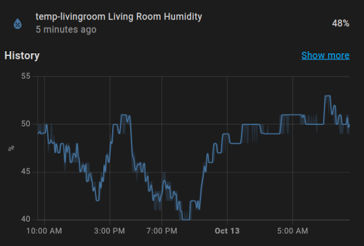
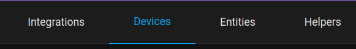
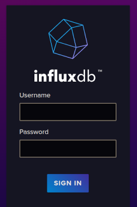
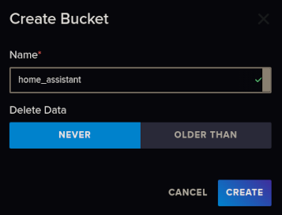
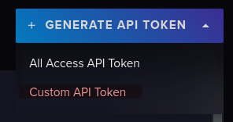
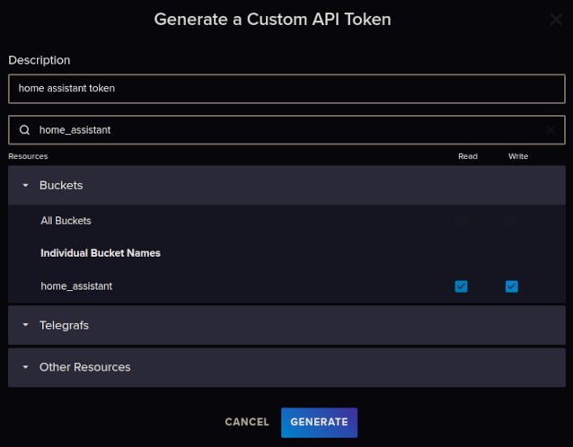
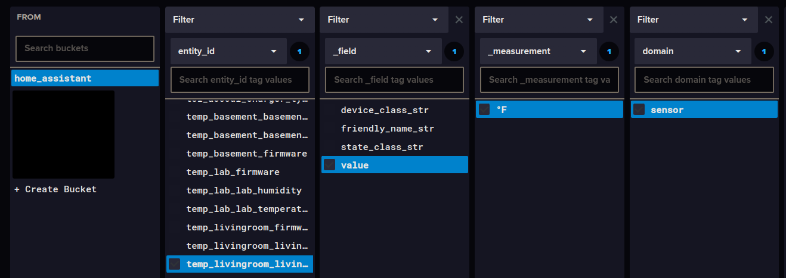

## Introduction:

[Home Assistant](https://www.home-assistant.io/) has become an integral part of my self-hosting / homelab journey. 

My first project was to build ESP32-based temperature and humidity sensors that would report metrics back to Home Assitant. That way, not only would I have real-time data about my house, I could track trends over the seasons! These graphs show when my furnace or AC was kicking on, and could be used for comparisons later after doing insulation projects and home improvement.

A core issue with this is that by default, **my metrics were being wiped after 10 days**. I needed a much longer retention period (indefinitely, if possible). I also wanted to have a real-time copy of the data outside of Home Assistant, as it would be difficult to replace *years* of metrics!



## Overview:

In this guide we will configure Home Assistant to keep sensor data for longer than the 10-day defaults. Then we will connect it to InfluxDB v2 running on a separate server, which will copy HA sensor data for additional long-term storage and data visualization.

The best time to setup this exporter is on a new installation, or when first adding the entities that you want to export to InfluxDB. **Home Assistant only exports data from *after* the exporter was setup**, and does not copy over historical data.

> :memo: **Note:** Installing Home Assistant, InfluxDB and creating Grafana dashboards with the data is outside of the scope of this guide, but may be covered in the future.

## Configuration / Process:

To begin with, you will need to have a running Home Assistant server, InfluxDB and something that you want to track. I'm currently using a Raspberry Pi 4 with the [Home Assistant Operating System](https://www.home-assistant.io/installation/raspberrypi), which is a very user-friendly way to get started. I recommend this if you're just getting started. 

Add/setup the device you'd like to track. This could be pretty much anything in HA that has state data. For easy examples, go the web UI and go to `Settings > Devices & Services` and click on the Devices tab, then `Add Device` or go to the device page of an existing one. 



### Editing Metric Retention Period

The simplest way to do this is to set a global value in the `configuration.yaml` file for Home Assistant. Based on your installation method, the process may be slightly different. I will describe the method for Home Assistant OS, but check out the [Home Assistant guide](https://www.home-assistant.io/docs/configuration/) if needed.

> :memo: **Note:** If you're okay with using InfluxDB for visualizations, and you don't plan to use the built-in Home Assistant graphs for long-term data, you can skip this step. I like to have it in both places. 

1. Login to the Home Assistant web UI with an admin account.
2. Open File Editor on the left sidebar, then click on the Folder icon on at the top left to browse files.

3. Open the file called `configuration.yaml`
4. Find the configuration line starting with `recorder:` (You can use `Ctrl + F` to search if needed). If it doesn't exist, add the following to the bottom of your `configuration.yaml`. This will set the retention period to **three years**:

```yaml
# Configure days of sensor history to keep
recorder:
  purge_keep_days: 1095
```
> :memo: **Note:** My use case is simple and I have a 256GB SSD attached to Home Assistant server, so storage space isn't too much of an issue. You may want to limit this retention period if you have a lot of devices or limited storage. 

5. Click the Disk icon on the top-right to save your changes. 
6. Restart Home Assistant to apply the new configuration. You can do this with a full reboot of your server, or by going to `Settings`, clicking the three dots in the top right corner, clicking `Restart Home Assistant > Quick reload`.

Before setting the `purge_keep_days` to a year or more, I tested with a few weeks and confirmed that the data was actually being kept. This setting above has worked for me for over a year now. 

### Configure InfluxDB Bucket

We'll need to setup a new bucket to store our Home Assistant metrics.

1. Login to your InfluxDB web UI. 



2. In the left sidebar, go to `Load Data > Buckets` then click `Create Bucket` on the right side of the screen. 


3. Give it a name and set your desired `Delete Data` policy. Since I want to keep all sensor data indefinitely, I'm using `Never`, which shows up as `Retention: Forever` on the Load Data screen. 



### Create an API Token: 

Home Assistant will need to authenticate in order to write to this database, which requires an API token. For security, we will create a token that works for just the Home Assistant bucket. 

1. In InfluxDB web UI, go to `Load data > API Tokens` then click `Generate API Token` on the right side of the screen and choose `Custom API Token`



2. Add a description, then search for the bucket we created earlier and assign access to just that bucket.



3. Click Generate, then **copy and save your token somewhere safe**, like a password manager. It cannot be displayed again!

### Add & Configure InfluxDB Integration:

Now we need to add an Integration to Home Assistant so it supports transferring all state changes to InfluxDB. This is enabled by referencing it in our `configuration.yaml`, rather than adding it through the UI. 

For all configuration parameters, see [InfluxDB Integration Docs](https://www.home-assistant.io/integrations/influxdb/).

1. Back in the Home Assistant UI, go to `File Editor` and open the `configuration.yaml` again. 
2. At the bottom, start by adding a new section referencing `influxdb` and then configure it's parameters. Here's an example of what a simple configuration may look like:

```yaml
influxdb:
  api_version: 2          # Use api_version 2 for InfluxDB 2.0
  ssl: true               # Defaults to true, set to false if not using https
  host: 192.168.1.22     # InfluxDB host IP or domain name
  port: 8086              # InfluxDB Port
  token:                  # Home Assistant API token
  organization: home      # The InfluxDB organisation that the bucket will belong to.
  bucket: home_assistant  # The name of the bucket we created earlier
  max_retries: 3          # How many times to retry if there is a network error
  include:
    entities:
      - sensor.temp1_living_room_humidity
      - sensor.temp1_living_room_temp
      - sensor.temp2_dining_room_humidity
      - sensor.temp2_dining_room_temp
```
By default, Home Assistant will export *all* entity data. You can narrow it down and selectively export data by using the `include` section in the example above. 

To find the names of specific entities, browse to `Settings > Devices & Services > Entities` in the Home Assistant web UI. Then open an entity and click the gear icon to view `Entity ID`, which you can use to copy and paste into your configuration.

Remove the `include:` and `entities:` sections in this example to export all possible metrics. 

> :memo: **Note about using reverse proxies/SSL for InfluxDB:** 

My InfluxDB intance is sitting behind Traefik w/ HTTPS, so it's securely accessed at a URL such as `https://influxdb.runestone.tech` rather than `http://ipaddress:8086`. 

In this scenario, `influxdb.runestone.tech` points to the IP address of my Traefik server. Traefik is then configured to route all requests for `influxdb` over `https` (port 443) to the destination server, where the InfluxDB container is listening on port 8086.

If you're using this kind of setup and you want to utilize SSL for your API connections, put the hostname of your InfluxDB service in the `host:` section and configure `port:` to use 443, just as if you were connecting with your web browser:
```yaml
ssl: true
host: influxdb.runestone.tech
port: 443
``` 

3. Once you have built your configuration, click the Save icon. You can use the `Developer Tools` button on the left sidebar and use `Check Configuration` to make sure the yaml is properly formatted. 
4. Do a full restart on Home Assistant to begin exporting metrics to InfluxDB. Reloading just the configuration did not work for me, I had to reboot the OS to see data. 

### Confirming Data Exports to InfluxDB

Back in the InfluxDB web UI, we can view the metrics from Home Assistant.

1. Go to `Data Explorer` in the left sidebar. In the first box, `From`, find the bucket you created for the Home Assistant data.
2. Now you can filter based on what you are exporting to InfluxDB. In the Filter box, select a key such as `_measurement` or `entity_id` and drill down to find your desired metric. Here's an example from my bucket:



3. Then on the middle-right, choose your time frame such as `Past 15m` and click `Submit`. This will plot a graph with your data at the top of the page. 

Once you confirm the data is showing up, you can use the built-in InfluxDB Data Explorer to visualize your data, or connect a tool like Grafana to build out dashboards.

## Closing Thoughts:

Data analytics/visualization is fun! I hope this helped you expand the capability of your Home Assistant setup. Check back periodically for more writeups about this and a deeper look into creating a dashboard with the data from Home Assistant + InfluxDB. 

## References & Resources:

- https://www.home-assistant.io/
- https://www.home-assistant.io/installation/raspberrypi
- https://www.home-assistant.io/integrations/influxdb/
- https://community.home-assistant.io/t/preserve-the-history-of-certain-sensors-for-a-longer-period-of-time/576039
- https://community.home-assistant.io/t/sqlite-to-influxdb-migration-of-historical-data/136926/26
- https://blog.wesselhissink.nl/homeautomation/long-term-home-assistant-data-history-with-influxdb/
- https://blog.sandydrew.com/2022/08/home-assistant-influxdb-config
- https://dev.to/admantium/home-assistant-collecting-sensor-data-with-influxdb-3mfl

## Version History:

**Author:** blackfeather@runestone.tech
**Version:** 1.00
**Last Updated:** 2024-10-13