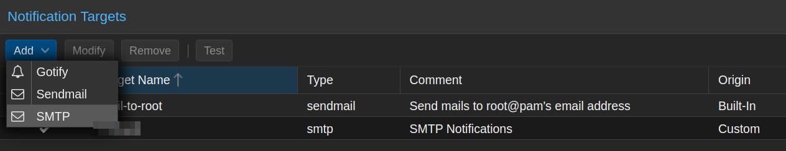
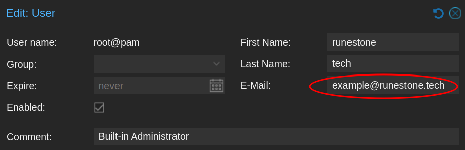
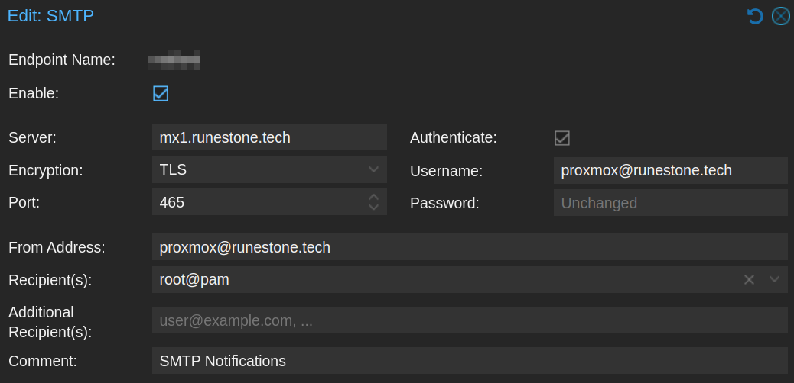
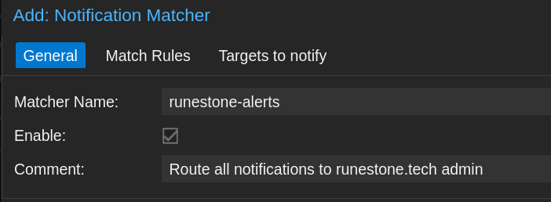
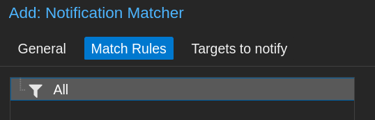
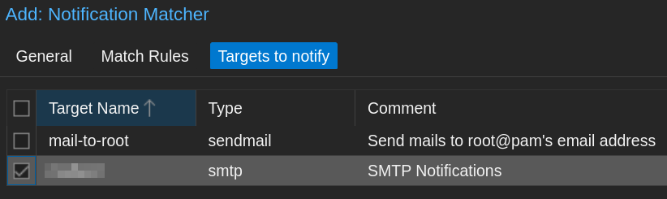

## Introduction:

I've been running Proxmox Virtual Environment in some incarnation or another for 6+ years now. My current cluster runs DNS and other critical functions. 

As I rely on Proxmox more and more, I realize I need better monitoring. My goal is to be alerted as soon as something goes wrong, as well as receive notifications when important tasks are successful. 

I had a few pitfalls when configuring this, so I've outlined the process below. 

## Overview:

By default, Proxmox has three built-in notification types: *Gotify*, *Sendmail*, and *SMTP*. You can access this menu by going into the `Datacenter > Notifications` view on your host:


Proxmox includes postfix installed as part of the OS. It does have the ability to act as an outbound email server directly. However, ISPs may block outbound on residential IPs, and many providers will send this kind of mail to spam. 

To get around this, let's configure SMTP to relay through my external email server.


## Configuration Steps

> :memo: **Note:** This process is almost identical for Proxmox Backup Server (PBS). Users are instead configured in `Configuration > Access Control`

### Email Setup
First, let's configure the admin's email address. This email will *receive* all of our alerts. This will be our notification inbox. You may have done this during installation.

1. Go to `Datacenter > Permissions > Users` 
2. Edit the account and fill out the details as desired. Make sure the email exists or is an alias at your provider.
> :memo: **Note:** We are using the built-in admin account for this example. If you have an identity setup with Keycloak or other authentication service, changing your email here may impact authentication! 




3. In `Datacenter > Notifications`, click on `Add > SMTP`.
4. Fill out the details, using the desired account information:
> :memo: **Note:** Username/From Address is your sending account. This should be a **dedicated service account** for Proxmox. Don't reuse credentials or put in your personal e-mail here!  


**Explanation:**
- The "server" field is your sending server. In this case, the VPS hosting my email. You could potentially use Google, Microsoft 365 or another hosted service here. Change ports as needed, though I **strongly recommend** using TLS.
- You must use Authentication, otherwise you have an open relay. Enter the SMTP credentials you setup.
- Recipient is root@pam or the account from step 2. Proxmox will send to the email address in this user's profile.

5. **Disable** the original `mail-to-root` notification target when you have created your new SMTP target.
6. Click the `Test` button and confirm you receive the email at your configured address.


### Update Datacenter Address:

Now that the SMTP profile is configured, we need to update the Datacenter from address. If you don't do this, it can result in your email being rejected, since it will send as `root@$hostname`
1. Go to `Datacenter > Options`. Find the **"Email From Address"** field and edit it. 
2. Use the same **From Address** that you configured in the SMTP profile.

### Update Notification Matchers:

Now that the email is configured, we must change the notification settings to use our new profile. 

1. In `Datacenter > Notifications`, go to `Notification Matchers` and click `Add`.
2. **General:** Create a matcher name and comment. You can't use periods in the matcher name. 

3. **Match Rules:** Select the default All for now. This is very customizable if you want certain alert types to go to specific users. ([Learn More](https://pve.proxmox.com/wiki/Notifications#notification_matchers))

4. **Targets to notify:** Select the new SMTP option you configured. Uncheck mail-to-root, since it's using sendmail.

5. Save your settings. Then open the initial default-matcher and disable it.

### Update Notification Profiles + Testing:

A straightforward way to test is to run a backup job and verify it sends out a backup status email. 

1. Go to `Datacenter > Backup` and select an existing backup job. If there aren't any, create one. 
2. Under the **General** tab, change the `Notification Mode:` drop-down to **Notification System**. This will set it to use the SMTP profile + Notification Matcher we just configured.  

> :memo: **Note:** By default, backup jobs are set to the Default (Auto) method. This does **not** utilize the SMTP profile you configured, and may result in frustrating e-mail rejection. If you want SMTP notifications to work, you must select `Notification System`
3. Save your settings and click `Run Now` and wait for the backup to complete. I like testing this with a small LXC container because I can quickly re-run it. Verify you receive a backup summary email.

## Troubleshooting:

### Mail Not Being Sent
Watch your system logs, either through the GUI at `$hostname > System > System Log` , or follow the mail logs at `/var/log/mail.log` on your Proxmox system. This will show the details of each SMTP transaction. 

When I followed the steps above, I was successfully getting my backup alerts from the configured email address. Yet when I looked at the Proxmox system logs, something weird was happening:

```bash
proxmox postfix/smtp[1966508]: 37291456EC: to=<example@runestone.tech>, relay=mx1.runestone.tech[xx.xx.xx.xx]:25, delay=370199, delays=370198/0.01/0.44/0.15, dsn=4.1.8, status=deferred (host mx1.runestone.tech[xx.xx.xx.xx] said: 450 4.1.8 <root@proxmox.homelab.runestone.tech>: Sender address rejected: Domain not found (in reply to RCPT TO command))
```
Proxmox was *still* trying to send some mail as the root/local user, ignoring the SMTP profile I just configured. 

The issue was that my postfix queue had dozens of failed alerts from the previous configuration. It was continuously attempting redelivery, with greater and greater delays, per the email standards. 

1. Open a terminal on your Proxmox host and view a json list of all deferred email:

```bash
root@proxmox:/etc/postfix# postqueue -j
{"queue_name": "deferred", "queue_id": "67AAF408DC", "arrival_time": 1723133392, "message_size": 24590, "forced_expire": false, "sender": "root@proxmox.homelab.runestone.tech", "recipients": [{"address": "example@runestone.tech", "delay_reason": "host mx1.runestone.tech[xx.xx.xx.xx] said: 450 4.1.8 <root@proxmox.homelab.runestone.tech>: Sender address rejected: Domain not found (in reply to RCPT TO command)"}]}
```

This email may be stalled in `/var/spool/postfix/deferred` or similar. 

2. If your deferred email was due to a network issue and *not* an authentication problem (such as domain not found), flush and attempt redelivery on all mail: `postqueue -f`
3. If your deferred email was due to a bad previous configuration like mine, and these alerts are all stale, **delete all deferred mail** to clear the queue:
```bash
root@proxmox:/var/spool/postfix# postsuper -d ALL deferred
postsuper: Deleted: 28 messages
```
> :memo: **Note:** If you are running a cluster, you will need to run these commands on each host.

## Closing Thoughts:

At this point, you should have fully functional notifications for backup jobs, cron jobs and more relaying through your SMTP server. This is a simplified version of the setup. Check out the resources below to learn more.

## References & Resources:
- https://pve.proxmox.com/wiki/Notifications
- https://forum.proxmox.com/threads/email-alerts-do-not-work.106027/
- https://forum.proxmox.com/threads/get-postfix-to-send-notifications-email-externally.59940/
- https://blog.rymcg.tech/blog/proxmox/03-notifications/
- https://www.postfix.org/postqueue.1.html
- https://www.postfix.org/postsuper.1.html

## Version History:

**Author:** blackfeather@runestone.tech
**Version:** 1.00
**Last Updated:** 2024-08-09