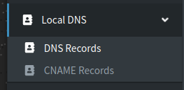
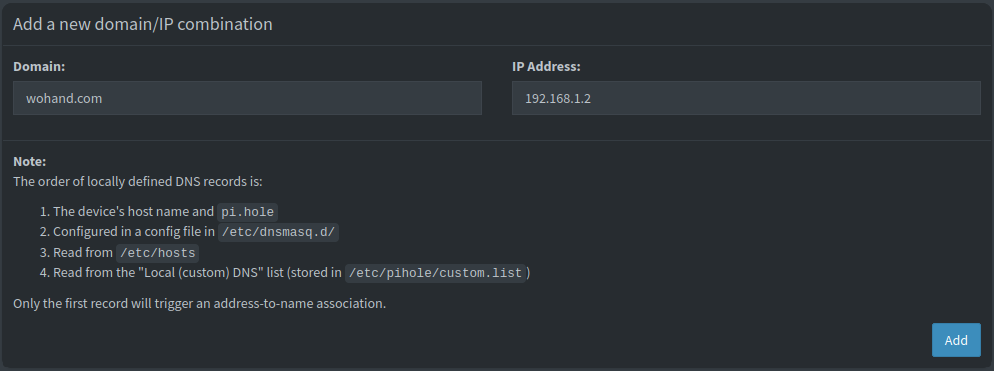
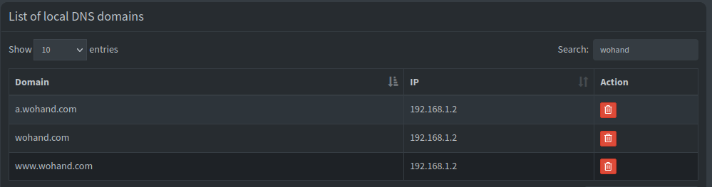
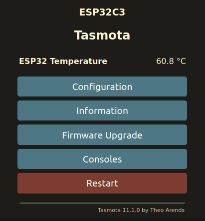
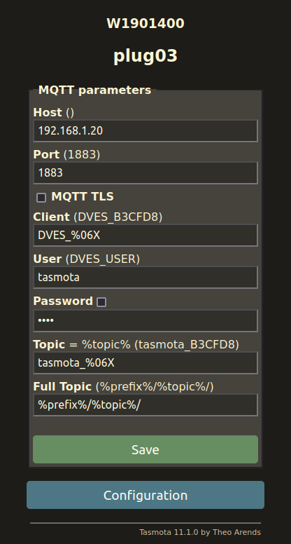
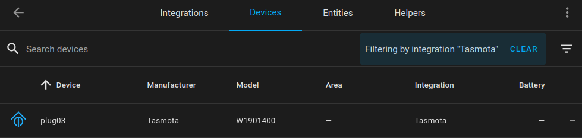

The Switchbot Mini is an ESP32-based smart plug, and comes in affordable 4-packs. It can be flashed over the air and requires no disassembly. In this tutorial we will be flashing the devices with Tasmota firmware, then adding to Home Assistant for control and power monitoring.

> :memo: **Note:** This tutorial assumes you already have a working Home Assistant server with the Tasmota integration and an MQTT broker installed like Mosquitto. We will have a guide for this soon too.

We are not sponsored or endorsed by SwitchBot. We chose the W1901400 because it's one of the most affordable options that supports open source firmware and OTA flashing.

## Requirements
- Switchbot Mini Plugs (W1901400 or W1901401)
- Kill A Watt P4400 or similar
- Home Assistant with Tamsota integration and MQTT broker
- Ability to add custom network-wide DNS entries (This guide will use Pi-Hole)
- Android or iOS phone to use the SwitchBot app during setup.
- Linux device to run the switchbOTA web server hack.

## Procedures:

### Initialize SwitchBot Plug:
> :memo: **Note:** We recommend using an isolated IoT network for smarthome devices whenever possible.

1. Plug in the SwitchBot Mini to a nearby outlet. Don't press the power button on the SwitchBot yet.
2. Install the SwitchBot app on your phone. You only need it for initial setup. [Google Play](https://play.google.com/store/apps/details?id=com.theswitchbot.switchbot) or [App Store](https://apps.apple.com/us/app/switchbot/id1087374760).
3. Create a [SwitchBot Cloud account](https://us.switch-bot.com/pages/register-account). We recommend using a disposable email address for this. You only need it to initialize new devices.
4. Open the app. Enable Bluetooth. Login to your Switchbot account under `Profile > Manage Homes`. 
5. Open the app and select `Add a Device`. Choose Plug Mini and follow the instructions. [SwitchBot Guide](https://support.switch-bot.com/hc/en-us/articles/5265364254871-How-to-Set-Up-SwitchBot-Plug-Mini).
6. Access the plug in the app. Deny the firmware upgrade. Confirm you're on v1.4 by clicking the Gear, then selecting `Firmware Version`. Turn the plug on and off using the app to confirm functionality.

> :memo: **Note:** We have used switchbOTA on stock firmware 1.3 and 1.4. It may work on newer versions, but don't update it if you don't have to. 

### Setup SwitchbOTA Web Server:

The switchbOTA web server will spoof update requests and force the smart plug to install Tasmota firmware.

You will need a Linux device for this step. You can use your workstation or a VM/server. In our example, we will use a Raspberry Pi 4B running Ubuntu 20.04. **This tutorial assumes you have SSH/shell access and sudo permissions**

1. Login to the Linux device with SSH or the shell.
2. Follow the official [NodeSource guide](https://github.com/nodesource/distributions) to enable the Node.js repository for your distro.
3. Install Node.js binary and git: `sudo apt-get update && sudo apt-get install nodejs git -y`
4. Run `npm --version` to confirm it's active.
5. Create your project directory, and enter it.
```bash
mkdir -p /home/ubuntu/projects/ && cd $_
```
5. Clone switchbOTA from Github, enter it.
```bash
git clone https://github.com/kendallgoto/switchbota/
cd switchbota/
```
6. Download the firmware binary.
```shell
wget https://github.com/kendallgoto/switchbota/releases/download/v1.1/app.bin
```
7. Change directory, run the web server.
```shell
cd server/
npm i
sudo node index.js
```
### Configure DNS:

We will now need to create an internal DNS entry that will redirect traffic from the real SwitchBot update server to our switchbOTA server so it can receive the Tasmota package.  

> :memo: **Note:** We will use Pi-hole in this example, which is controlling DNS for our wifi. You may need to do this in your firewall or router. Setting up a DNS server is beyond the scope of this guide.

1. Login to Pi-hole and click on `Local DNS > DNS Records` in the sidebar.



2. Add DNS records for the 3 `wohand.com` domains, which is the update server for SwitchBot. Point each of them at the IP address of your Linux box running the Node.js web server

> :memo: Note: If you don't know your web server IP, login to its shell, run `ip a` and look for the relevant adapter such as `eth0` or `wlan0`.

```
a.wohand.com
wohand.com
www.wohand.com
```





### Flash Tasmota:

> :fire: **Note:** It is possible to brick your smart plug if the OTA update is interrupted. Keep this in mind and proceed with caution!

Now that we have the web server running, it will serve the Tasmota firmware when it receives an update request. 
1. Open the SwitchBot app and find your plug.
2. Click on the gear, then on `Firmware Version` and then `Firmware Upgrade` to download and install Tasmota.
3. Watch the terminal on your Linux server while the SwitchBot plug installs the payload:
```shell
ubuntu@rpi:~/projects/switchbota/server$ sudo node index.js 
Server listening on port 80
::ffff:192.168.1.10 - /version/wocaotech/firmware/WoPlugUS/WoPlugUS_V15.bin
::ffff:192.168.1.10 - /payload.bin
```
---
Wait a few minutes for flashing to complete. At this point the device will reboot and one of two things can happen:
- You can browse to the IP address of the SwitchBot plug and configure Tasmota (i.e. http://192.168.1.10:80)
-  The plug will appear dead and won't respond on the network.

All the times we have flashed these, we have experienced option 2. Don't worry! This most likely means the device lost its wifi configuration, and instead is broadcasting its own SSID for initial setup. 

1. Using your phone or laptop, check for nearby networks. You may see an open network with a name like `tasmota-B3CFD8-4056`or `switchbota`
2. Join the network. It will take you to a captive portal page in the browser. Now you can join the plug back to your wifi and begin setup. 
3. When you successfully join it to the wifi, it will show you the new IP address, stop broadcasting its own SSID, and you can proceed with the next steps.

> :memo: **Note:** The on/off light doesn't work until after updating Tasmota. If there is no fallback wifi even after unplugging and plugging it back in, and you think the device is bricked, you may be able to recover it by taking it apart and programming it manually. See the [Tasmota page](https://templates.blakadder.com/switchbot_plugmini_W1901400.html) for instructions.

Once your device is flashed, feel free to delete it from the SwitchBot app. You can no longer use this app to communicate with it. 

### Configure Tasmota
1. Browse to your newly flashed plug. You must use http or specify port 80 if your browser tries to do https redirection automatically.



2. Click on `Configuration > Configure Other`. Overwite the Template field with the one found [here](https://templates.blakadder.com/switchbot_plugmini_W1901400.html) under `Configuration for ESP32-C3`. This will begin with `{"NAME":"W1901400","GPIO":`. Check Activate. 
3. Change any other fields as desired, such as `Device Name` or enabling a web admin password, then click save. The device will now reboot.

> :memo: **Note:** We recommend enabling a web admin password. This will prompt you for authentication when accessing the configuration page. The username is `admin` and it will use the password you set.
4. When the page reloads, try the `Toggle` button. You should hear the switch click and the LED will change. Try attaching a load like a lamp and it will turn the lamp on and off.

### Power Calibration

Out of the box, the newly-flashed plug will be wildly inaccurate. For example, ours was configured for 173v rather than 120v, so all readings will be way off. To fix this, please follow [the power calibration guide](https://tasmota.github.io/docs/Power-Monitoring-Calibration/) from Tasmota. We used a `Kill A Watt P4400` and a halogen lamp for load testing on ours.

### Add to Home Assistant
Congratulations! Your SwitchBot plug now has open source firmware and doesn't phone home to the cloud. You can control the on/off switch using the Tasmota landing page. Let's add it to Home Assistant for ease of use and monitoring!

1. Login to the Tasmota web admin for the SwitchBot plug. 
2. Navigate to `Configuration > Configure MQTT`



3. In the `Host` field, enter the IP address of your Home Assistant server running an MQTT broker.
4. Configure the other settings if needed, such as MQTT TLS or passwords. For autodiscovery, we have a `tasmota` user in HA, and the smart plugs login with this username/password combo.
[]()
5. Press Save. The device will restart.
6. Open Home assistant. Go to `Settings > Devices and Services > Tasmota`. Click on the device count and locate your device, then configure your dashboards as desired.



## Final Words

The initial setup / first run of this tutorial can be *daunting*, especially if you're new to any of this. It can take several hours of trial and error to get everything working as desired. 

That said, once you have the initial tools setup and you're more comfortable with OTA flashing, configuring a new plug and importing into HA can be a quick process. It takes us less than 15 minutes per plug from initializing to the plug showing up in HA at the end of the process.

## References & Resources:
- https://www.home-assistant.io/integrations/tasmota/
- https://us.switch-bot.com/products/switchbot-plug-mini
- https://github.com/kendallgoto/switchbota/
- https://templates.blakadder.com/switchbot_plugmini_W1901400.html
- https://en.wikipedia.org/wiki/Kill_A_Watt
- https://community.home-assistant.io/t/using-switchbot-mini-plug-with-tasmota32-and-mqtt-as-ble-gateway-for-xiaomi-lywsd03mmc-temp-sensors/455287
- https://support.switch-bot.com/hc/en-us/articles/5265364254871-How-to-Set-Up-SwitchBot-Plug-Mini
- https://apps.apple.com/us/app/switchbot/id1087374760
- https://play.google.com/store/apps/details?id=com.theswitchbot.switchbot
- https://us.switch-bot.com/pages/register-account
- https://github.com/nodesource/distributions/blob/master/README.md
- https://tasmota.github.io/docs/Power-Monitoring-Calibration/

### Version History:
**Author:** blackfeather@runestone.tech
**Version:** 1.02
**Last Updated:** 3-22-2024
